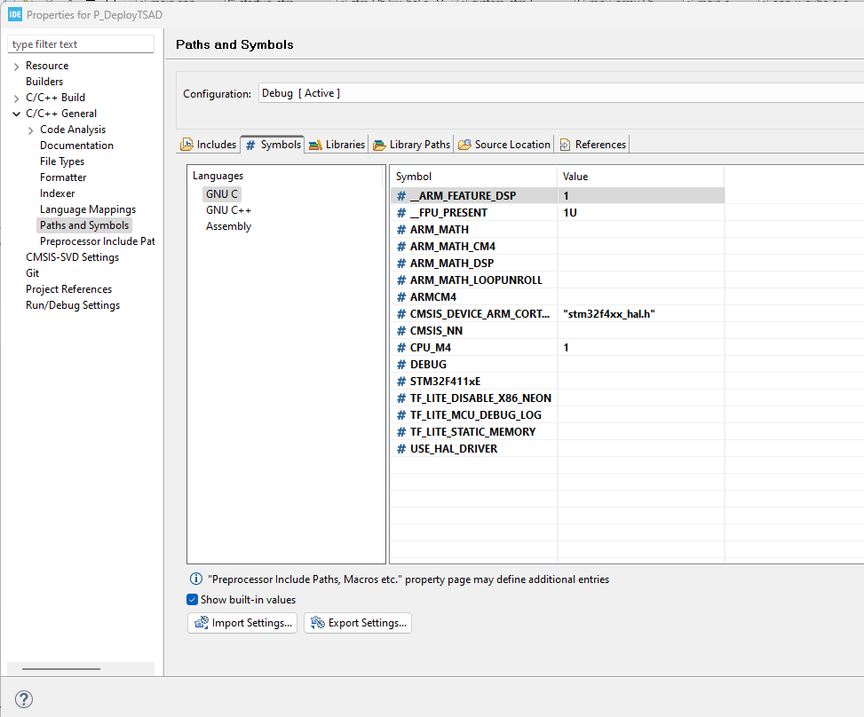
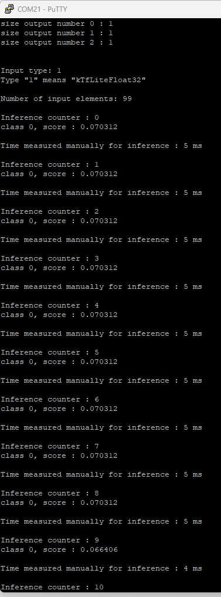
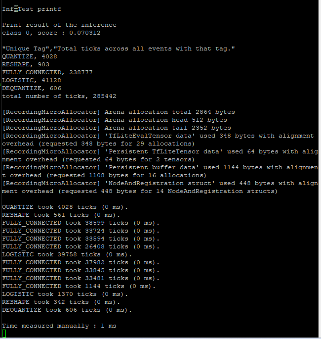
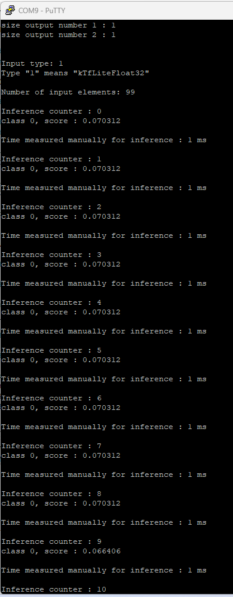

# TinyML-STM32
This repo contains a Nucleo-F411RE and a Nucleo-H7A3ZI-Q firmware project. It enables inference with the FTLite Micro engine on NASA-MSL data. 

# Getting started

To test the project on a Nucleo-F411RE or a Nucleo-H7a3ZI-Q, you juste need to STM32CubeIDE and Git installed on Windows or Linux.
Versions tested : 
- Windows 11 : STM32CubeIDE v1.13.2, STMCubeMX v6.10.0
- Linux Ubuntu20.04 : STM32CubeIDE v1.13.2

To test inference on a Nucleo board, follow the instructions below :
1. Clone the repo :

    ```bash
    git clone --recursive git@github.com:AII4-0/TinyML-STM32.git
    ```
3. Open STM32CubeIDE and open as workspace the repo cloned.
4. Import the project as following :
    1. File > Import > General > Existing Projects into Workspace
    2. Next
    3. Browse and select P_DeployTSAD (Nucleo-F411RE) or P_DeployTSAD_h7 (Nucleo-H7A3ZI-Q) folder.
    4. Finish
5. Build the project with the hammer.
6. Connect the Nucleo via an USB cable to your PC.
7. Open a terminal or putty to open a virtual serial port where the Nucleo is connected. Set the baudrate to 9600. For the project **P_DeployTSAD
    
    

8. In the STM32CubeIDE, start debugging.
9. You can change the configuration if you change the define below in the main.cpp file.
    ```cpp
    /* Private includes ----------------------------------------------------------*/
    /* USER CODE BEGIN Includes */
    #define RUN_INFERENCE	// Choose RUN_INFERENCE or BASELINE_MEMORY_FOOTPRINT or PROFILE_MEMORY_AND_LATENCY
    #define LSTM_QUANT				//Choose between LSTM_QUANT, GAN or GAN_QUANT
    ```

# How to reproduce these Nucleo project from scratch

## Prerequis

This installation is tested on Ubuntu20.04 with python3.9 installed.

1. Clone the repo with the submodule

    ```bash
    git clone --recursive git@github.com:AII4-0/TinyML-STM32.git
    cd TinyML-STM32
    ```

2. Install dependencies below and STM32CubeIDE (tested with v1.13.2).

    ```bash
    # Create virtual env
    sudo apt update
    sudo apt install make git zip

    python3.9 -m venv venv39
    source venv39/bin/activate

    pip install -r tsad-benchmark/requirements/requirements.txt
    pip install -r tsad-benchmark/requirements/requirements_tflite.txt
    ```

## 1 Generate the TFLite model and export data

1. Go to the submodule tsad-benchmark and generate the model. Refer to the readme of the submodule for more information.

    ```bash
    cd tsad-benchmark

    ############################################
    # Prepare data, train the mode and export it
    ############################################
    # LSTM
    python3 main.py --dataset NASA-MSL --batch_size 1024 --window_size 100 --model LSTM --epochs 10 --hidden_size 256 --num_layers 2 --dropout 0 --prediction_length 1 --learning_rate 0.001 --export_folder ../output
    # GAN
    python3 main.py --model GAN --dataset NASA-MSL --epochs 10 --batch_size 512 --window_size 100 --hidden_size 128 --prediction_length 1 --num_layers 3 --learning_rate 0.001 --export_folder ../output

    ##############################################
    # Convert the exported model into TFLite model
    ##############################################
    # LSTM - entity 0
    python3 convert_to_tflite.py --dataset NASA-MSL --entity 0 --window_size 100 --model ../output/lstm_0.pt
    # LSTM - entity 1
    python3 convert_to_tflite.py --dataset NASA-MSL --entity 1 --window_size 100 --model ../output/lstm_1.pt
    # GAN - entity 0
    python3 convert_to_tflite.py --dataset NASA-MSL --entity 0 --window_size 100 --model ../output/gan_0.pt

    ###################################
    # Test the model exported in TFLite
    # and convert dataset in C source
    ###################################
    # LSTM TFLite - entity 0
    python3 check_tflite_model.py --dataset NASA-MSL --entity 0 --window_size 100 --pytorch_model ../output/lstm_0.pt --tflite_model ../output/lstm_0.tflite --start_index_inputs_exported_in_c 400 --n_inputs_exported_in_c 100
    # LSTM TFLite - entity 1
    python3 check_tflite_model.py --dataset NASA-MSL --entity 1 --window_size 100 --pytorch_model ../output/lstm_1.pt --tflite_model ../output/lstm_1.tflite --start_index_inputs_exported_in_c 400 --n_inputs_exported_in_c 100
    # GAN TFLite - entity 0
    python3 check_tflite_model.py --dataset NASA-MSL --entity 0 --window_size 100 --pytorch_model ../output/gan_0.pt --tflite_model ../output/gan_0.tflite --start_index_inputs_exported_in_c 400 --n_inputs_exported_in_c 100

    #############################################
    # Test the model exported in quantized TFLite
    # and convert dataset in C source
    #############################################
    # LSTM TFLite quantize - entity 0
    python3 check_tflite_model.py --dataset NASA-MSL --entity 0 --window_size 100 --pytorch_model ../output/lstm_0.pt --tflite_model ../output/lstm_0_quant.tflite --start_index_inputs_exported_in_c 400 --n_inputs_exported_in_c 100
    # LSTM TFLite quantize - entity 1
    python3 check_tflite_model.py --dataset NASA-MSL --entity 1 --window_size 100 --pytorch_model ../output/lstm_1.pt --tflite_model ../output/lstm_1_quant.tflite --start_index_inputs_exported_in_c 400 --n_inputs_exported_in_c 100
    # GAN TFLite quantize - entity 0
    python3 check_tflite_model.py --dataset NASA-MSL --entity 0 --window_size 100 --pytorch_model ../output/gan_0.pt --tflite_model ../output/gan_0_quant.tflite --start_index_inputs_exported_in_c 400 --n_inputs_exported_in_c 100


    cd ..
    ```

## 2 Test TFLite model on the host

The tsad-benchmark repo test the TFLite model with the python framework. A good practice is to test the TFLite model on the host with the TFLite C++ framework. It's based on the minimal example [here](https://github.com/tensorflow/tensorflow/tree/master/tensorflow/lite/examples/minimal).

Follow the procedure below to test the model.

1. Install CMake 3.16 or higher
    ```bash
    sudo apt-get install cmake
    ```
2. Generate and compile the test program to test the model.
    ```bash
    cd P_DeployTSAD_host_in_C
    mkdir build
    cd build

    # Compile without GPU support on host
    cmake ../
    cmake --build . -j

    # Compile with GPU support on host
    cmake ../ -DTFLITE_ENABLE_GPU=ON
    cmake --build . -j

    # Compile for ARMv7 NEON enabled
    curl -LO https://developer.arm.com/-/media/Files/downloads/gnu/11.2-2022.02/binrel/gcc-arm-11.2-2022.02-x86_64-arm-none-linux-gnueabihf.tar.xz
    mkdir -p ${HOME}/toolchains

    tar xvf gcc-arm-11.2-2022.02-x86_64-arm-none-linux-gnueabihf.tar.xz -C ${HOME}/toolchains

    ARMCC_PREFIX=${HOME}/toolchains/gcc-arm-11.2-2022.02-x86_64-arm-none-linux-gnueabihf/bin/arm-none-linux-gnueabihf-
    ARMCC_FLAGS="-march=armv7-a -mfpu=neon-vfpv4 -funsafe-math-optimizations -mfp16-format=ieee"

    cmake -DCMAKE_C_COMPILER=${ARMCC_PREFIX}gcc \
    -DCMAKE_CXX_COMPILER=${ARMCC_PREFIX}g++ \
    -DCMAKE_C_FLAGS="${ARMCC_FLAGS}" \
    -DCMAKE_CXX_FLAGS="${ARMCC_FLAGS}" \
    -DCMAKE_VERBOSE_MAKEFILE:BOOL=ON \
    -DCMAKE_SYSTEM_NAME=Linux \
    -DCMAKE_SYSTEM_PROCESSOR=armv7 \
    ../

    cmake --build . -j
    ```
3. Test the model
    ```bash
    # ./minimal <model> <index to start inference in C_1_test_400.h>
    ./minimal ../../output/gan_0_quant.tflite 0
    ```
4. The result must be the same as the result of the `tsad-benchmark/check_tflite_model.py` script.


## 3 Generate the TFLiteMicro library for the embedded system

1. Generate the source tree

    ```bash
    cd tflite-micro
    python3 tensorflow/lite/micro/tools/project_generation/create_tflm_tree.py \
    --makefile_options="TARGET=cortex_m_generic OPTIMIZED_KERNEL_DIR=cmsis_nn TARGET_ARCH=project_generation" \
    /tmp/tflm-tree
    ```


## 4 Create a new project to deploy the model

1. Open STM32CubeIDE and open as workspace the repo cloned.
3. Create a new project : **File > New > New STM32 project** and choose the right board

    
4. Choose a name for the project and select C++ project. Click until finish.

    
5. Go the the pinout configuration tab and activate the CRC.

    
6. The configuration perspective open it. Go to the Clock configuration tab and set the clock to the max (100MHz)

    

7. Activate CPU cache (ICache, DCache), if available.
 
8. Save and generate the new C code.
9.  Right click on the project and create a new folder named **tensorflow_lite**.

    
10. Copy the content of the folder `/tmp/tflm-tree`, generated on the section [2 Generate the TFLiteMicro library for the embedded system](##-2-Generate-the-TFLiteMicro-library-for-the-embedded-system).

    ```bash
    cp -r /tmp/tflm-tree/* P_DeployTSAD/tensorflow_lite
    ```
11. Include Headers and source in build process. Go to project > Properties. Then, go to C/C++ General> Paths and Symbols > Includes tab > GNU C. Click Add. In the pop-up, click workspace. Select the tensorflow_lite directoy in your project. CHeck Add to all configurations and Add to all languages. Repeat the last two step to iclude directories show in the figure below.

    
12. Include the tensorflow_lite directory in the Source Location

    
13. In Settings > MCU Settings, check the option **Use float with printf from newlib-nano**. It's needed to print float values.

    
14. Add the compiler option `CMSIS_NN`, `ARMCM4`, `CMSIS_DEVICE_ARM_CORTEX_M_XX_HEADER_FILE`, `CPU_M4`, `TF_LITE_DISABLE_X86_NEON`, `TF_LITE_MCU_DEBUG_LOG`, `TF_LITE_STATIC_MEMORY` and `USE_HAL_DRIVER`. Check **Add to all configurations** and **Add to all languages**.

    

15. Add the compiler flag `MD` in **MCU GCC Assembler**, **MCU GCC Compiler** and **MCU G++ Compiler**

    

16. Modify the function `ticks_per_second()` of the file `P_DeployTSAD_h7\tensorflow_lite\tensorflow\lite\micro\cortex_m_generic\micro_time.cc`. It depends of the clock speed.
    ```c
    uint32_t ticks_per_second() { return SystemCoreClock; }
    ```
17. Rename main.c to main.cpp
18. Build the project
19. To be faster, add the compiler flag `-O3` in **MCU GCC Compiler** and **MCU G++ Compiler**. :

    

20. Implement your application and add model + data (gan_0_quant.cpp, gan_0_quant.h, C_1_test.h) in the project.

21. Follow the same procedure for the Nucleo-H7a3ZI-Q.

## 5 Create a project with STMCubeAI

1. Open STMCubeMX v6.10.0 and install X-CUBE-AI. Go to Help > Manage embedded software packages.

    

2. Create a new project selecting the button **ACCESS TO MCU SELECTOR**.
3. Via the filter, activate **Artificial Interlligence**. Select good options in relation with the exported model. Click on **Analyze**

    

4. Then, select the good board or MCU. Example : Nucleo-F411RE and click on start button.

5. Go to **Software Packs > Select Component**

    

6. Activate the core AI and select a type of application. Then, close the window.

    

7. Go to **Software Packs** and click on the AI package. A settings window opened...

    

8. Click on Analyze.

9. (Optionnal) Click on **Validate on target**

10. Go to **Project Manager** and select a project name, a path and choose the STMCubeIDE toolchain.

11. Finally, click **Generate Code** and open STM32CubeIDE to implement your application.

# 6 Evaluation of performance

## P_DeployTSAD

This project run on a Nucleo-F411RE and embedds a cortex-M4. There is a 512kB Flash and a 128kB RAM.

To measure the STM-HAL memory footprint, it's necessary to replace the define `#define RUN_INFERENCE` by `#define BASELINE_MEMORY_FOOTPRINT` in the main file.
Then, the memory footprint of TFlite ca be measured with `#define RUN_INFERENCE` or `PROFILE_MEMORY_AND_LATENCY`.

These measures are did with the `gan_0_quant` model.

Baseline memory footprint: 19.33 kB of flash, 2.38 kB of RAM
(.text section) in FLASH : 17.56kB


Size of the temporary memory used by the model in RAM: less than 4096 bytes => 4kB \
Size of the model in Flash (.rodata section) : 107kB \
Size of TFLite code (.text section) to do an inference : 84kB - 17.56kB = 66.44kB \
The validation dataset take 100 * 100 * 4 = 40 000 bytes => 39 kB in FLASH (.rodata section).


Inference time : 5ms


Results of quantize model on target vs on the host :

**Host**


**Target**




## P_DeployTSAD_h7

This project run on a Nucleo-H7A3ZI-Q and embedds a cortex-M7. There is a 2MB Flash and a 1.4MB RAM.

To measure the STM-HAL memory footprint, it's necessary to replace the define `#define RUN_INFERENCE` by `#define BASELINE_MEMORY_FOOTPRINT` in the main file.
Then, the memory footprint of TFLite can be measured with `#define RUN_INFERENCE` or `PROFILE_MEMORY_AND_LATENCY`.

These measures are did with the `gan_0_quant` model.

Baseline memory footprint: 24.39kB of flash, 2.5kB of RAM
(.text section) in FLASH : 22.27kB


Size of the temporary memory used by the model in RAM: less than 4096 bytes => 4kB \
Size of the model in Flash (.rodata section) : 107kB \
Size of TFLite code (.text section) to do an inference : 88kB - 24.39kB = 63.61kB \
The validation dataset take 100 * 100 * 4 = 40 000 bytes => 39 kB in FLASH (.rodata section).


Inference time : 1-2 ms \
In the image below, the inference has taken 1.02 ms.




Results of quantize model on target vs on the host :

**Host**


**Target**



## P_DeployTSAD_h7 with STMCubeAI

This project run on a Nucleo-H7A3ZI-Q and embedds a cortex-M7. There is a 2MB Flash and a 1.4MB RAM.

The AI model is ported on the target with STCubeAI. The using engine is STRuntime and not TFLite.

These measures are did with the `gan_0_quant` model.

Size of model params in FLASH (.rodata section) : 103kB \
Size of STRuntime code (.text section) : 47kB - 24.39kB = 22.61kB \
Size of the temporary memory used by the model in RAM: less than 4096 bytes => 4kB \
The validation dataset take 100 * 100 * 4 = 40 000 bytes => 39 kB in FLASH (.rodata section).


Inference time : 1-2 ms

Results of quantize model on target vs on the host :

**Host**


**Target**


## P_DeployTSAD_h7 with STMCubeAI using TFLiteRuntime

This project run on a Nucleo-H7A3ZI-Q and embedds a cortex-M7. There is a 2MB Flash and a 1.4MB RAM.

The AI model is ported on the target with STCubeAI. The using engine is TFLiteRuntime and not STMCubeRuntime.

These measures are did with the `gan_0_quant` model.

Size of model params in FLASH (.rodata section) : 107kB \
Size of TFLiteRuntime code (.text section) : 54kB - 24.39kB = 29.61kB \
Size of the temporary memory used by the model in RAM: less than 4096 bytes => 4kB \
The validation dataset take 100 * 100 * 4 = 40 000 bytes => 39 kB in FLASH (.rodata section).


Inference time : 1-2 ms

Results of quantize model on target vs on the host :

**Host**


**Target**


## P_DeployTSAD_host_in_C on the host

The project builded to use CPU, take 6-10ms to do the inference with the quantize model and 50-300us with fp32 model.


The project builded to use GPU, take 400-600us to do the inference with the quantize model and 15-100us with fp32 model.


## P_DeployTSAD_host_in_C on RPI4 

Version installed on RPI4 :


The project builded, take ~200us to do the inference with the quantize model and 250-300us with fp32 model.


## Resume

| Target            | Details                           | Inference time    |
| --------          | -------                           | -------           |
| Host x86          | CPU - quantized                   | 6-10 ms           |
| Host x86          | CPU - fp32                        | 50-300 us         |
| Host x86          | GPU - quantized                   | 400-600 us        |
| Host x86          | GPU - fp32                        | 15-100 us         |
| RPI4              | armv7 - quantized                 | ~200 us           |
| RPI4              | armv7 - fp32                      | 250-300 us        |
| Nucleo-F411RE     | TFLite Micro                      | 5 ms              |
| Nucleo-H7A3ZI-Q   | TFLite Micro                      | < 1 ms              |
| Nucleo-H7A3ZI-Q   | STMCubeAI - STMRuntime            | < 1 ms            |
| Nucleo-H7A3ZI-Q   | STMCubeAI - TFliteMicro Runtime   | < 1 ms            |

The inference time is slower on host, because the model is quantize. On x86, float is better. Reference: https://github.com/tensorflow/tensorflow/issues/21698#issuecomment-414764709


# Notes

[Add DSP support](https://community.st.com/t5/stm32-mcus/configuring-dsp-libraries-on-stm32cubeide/ta-p/49637)
